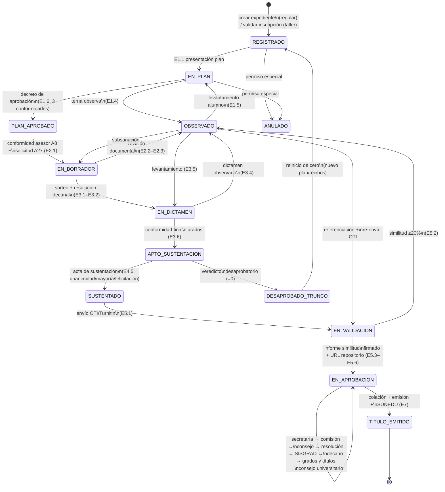
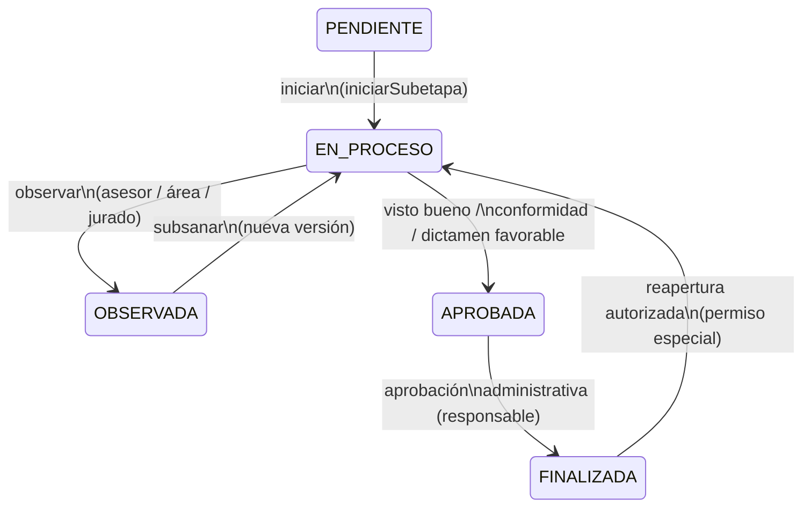

# Máquina de Estados del Expediente — Titulación FIPS / UNSA

> Reconcilia los estados **formales** (Taller USE FIPS + entrevista) con los estados
> **reales en producción** (`legacy-code/SeguimientoSubetapas.js → FLUJO_TITULACION`,
> `WorkflowEtapas.js`, `40_BD_MetadataV1.js → BD1_ESTADOS`).
> Notación: `ETAPA.SUBETAPA`. Los plazos son los de `FLUJO_TITULACION` (días hábiles).

## 1. Niveles de estado

| Nivel | Valores | Origen |
|---|---|---|
| Expediente (macro) | `REGISTRADO → EN_PLAN → PLAN_APROBADO → EN_BORRADOR → EN_DICTAMEN → APTO_SUSTENTACION → SUSTENTADO → EN_VALIDACION → EN_APROBACION → TITULO_EMITIDO` (+ `OBSERVADO`, `DESAPROBADO_TRUNCO`, `ANULADO`) | Derivado Taller §13–24 + entrevista |
| Subetapa (operativo) | `PENDIENTE → EN_PROCESO → (OBSERVADA ⇄ EN_PROCESO) → APROBADA → FINALIZADA` | Taller §24; `BD1_ESTADOS.proceso` |
| Documento | `PENDIENTE → CARGADO → (OBSERVADO ⇄ CARGADO) → APROBADO` (`RECHAZADO` cierra la versión) | `BD1_ESTADOS.documento` |
| Registro | `ACTIVO / INACTIVO / ELIMINADO` (borrado lógico; nada se borra físicamente) | `BD1_CONFIG.reglas`, `86_BD_EliminarExpedienteV176.js` |

Regla de avance (RN-09): **ninguna etapa cierra con subetapas obligatorias pendientes**;
`avanzarSiguienteEtapaV23` / `avanzarEtapaWorkflowV4` / `finalizarEtapaWorkflowV3` lo
impiden salvo permiso especial de administración.

## 2. FSM macro del expediente (Mermaid)

```mermaid
stateDiagram-v2
    [*] --> REGISTRADO: crear expediente\n(regular) / validar inscripción (taller)
    REGISTRADO --> EN_PLAN: E1.1 presentación plan
    EN_PLAN --> OBSERVADO: terna observa\n(E1.4)
    OBSERVADO --> EN_PLAN: levantamiento alumno\n(E1.5)
    EN_PLAN --> PLAN_APROBADO: decreto de aprobación\n(E1.6, 3 conformidades)
    PLAN_APROBADO --> EN_BORRADOR: conformidad asesor A8 +\nsolicitud A27 (E2.1)
    EN_BORRADOR --> OBSERVADO: revisión documental\n(E2.2–E2.3)
    OBSERVADO --> EN_BORRADOR: subsanación
    EN_BORRADOR --> EN_DICTAMEN: sorteo + resolución decanal\n(E3.1–E3.2)
    EN_DICTAMEN --> OBSERVADO: dictamen observado\n(E3.4)
    OBSERVADO --> EN_DICTAMEN: levantamiento (E3.5)
    EN_DICTAMEN --> APTO_SUSTENTACION: conformidad final\njurados (E3.6)
    APTO_SUSTENTACION --> SUSTENTADO: acta de sustentación\n(E4.5: unanimidad/mayoría/felicitación)
    APTO_SUSTENTACION --> DESAPROBADO_TRUNCO: veredicto\ndesaprobatorio (=0)
    DESAPROBADO_TRUNCO --> REGISTRADO: reinicio de cero\n(nuevo plan/recibos)
    SUSTENTADO --> EN_VALIDACION: envío OTI/Turnitin\n(E5.1)
    EN_VALIDACION --> OBSERVADO: similitud ≥20%\n(E5.2)
    OBSERVADO --> EN_VALIDACION: referenciación +\nre-envío OTI
    EN_VALIDACION --> EN_APROBACION: informe similitud\nfirmado + URL repositorio (E5.3–E5.6)
    EN_APROBACION --> EN_APROBACION: secretaría → comisión →\nconsejo → resolución → SISGRAD →\ndecano → grados y títulos →\nconsejo universitario
    EN_APROBACION --> TITULO_EMITIDO: colación + emisión +\nSUNEDU (E7)
    TITULO_EMITIDO --> [*]
    REGISTRADO --> ANULADO: permiso especial
    EN_PLAN --> ANULADO: permiso especial
```

## 3. Detalle por etapa (subetapas reales + guardas + salidas)

### E1 — Verificación Inicial de Documentos → `PLAN_APROBADO`

| # | Subetapa legacy | Plazo | Guarda de salida |
|---|---|---|---|
| 1.1 | Presentación del Plan de Tesis / Trabajo Académico | según alumno | 5 documentos + anexos 17/18/33 + carátula válida (RN-CAR) |
| 1.2 | Validación de documentos administrativos | 1–3 d.h. | revisión formal Srta. Angela OK |
| 1.3 | Asignación de jurados (terna) | 1–2 d.h. | terna = Director + asesor + afín registrada |
| 1.4 | Revisión del plan por la terna | 3–5 d.h. (entrevista: 5) | 3 respuestas; si hay observación → E1.5 |
| 1.5 | Levantamiento de observaciones por el alumno | 2–5 d.h. | nueva versión cargada |
| 1.6 | Emisión del decreto de aprobación | 2–4 d.h. | decreto con nombres exactos |

> Divergencia reconciliada: la norma habla de "7 etapas formales" del taller interno
> (plan → … → título); el sistema legacy las materializa en estas 7 etapas operativas
> E1–E7. La terna de E1.3–E1.4 **no** es el jurado de E3 (sorteo + resolución decanal).

### E2 — Presentación del Borrador de Tesis → habilita sorteo

| # | Subetapa legacy | Plazo | Guarda de salida |
|---|---|---|---|
| 2.1 | Carga de documentos | variable | A8 + A27 + DJ veracidad/penales + libreta/certificados + no-adeudos + recibo + foto JPG |
| 2.2 | Revisión documental | 2–5 d.h. | estructura tesis (resumen, keywords, abstract, APA) OK |
| 2.3 | Validación del expediente | 1–3 d.h. | checklist Etapa 2 completo (`validarChecklistCompletoEtapa2V27`) |

### E3 — Evaluación del Expediente → `APTO_SUSTENTACION`

| # | Subetapa legacy | Plazo | Guarda de salida |
|---|---|---|---|
| 3.1 | Recepción y validación del expediente | 1–2 d.h. | expediente conforme |
| 3.2 | Programación de sorteo de jurados | 2–7 d.h. | sorteo grabado + resolución decanal firmada |
| 3.3 | Revisión del borrador por jurados | **20 d.h.** (reglamento citado: 15) | dictámenes individuales emitidos |
| 3.4 | Emisión de observaciones | incluida | dictamen Favorable / Observado registrado |
| 3.5 | Levantamiento por el alumno | 2–10 d.h. | versión corregida |
| 3.6 | Conformidad final de jurados | 1–3 d.h. | todos conformes (con reiteraciones del área) |

> Divergencia reconciliada: reglamento 15 d.h. vs legacy 20 d.h. → se adopta **20 d.h.
> configurable** (`calendar-rules.md` RN-PLZ-03) con recordatorios; el acta solo admite
> observaciones **de forma**.

### E4 — Programación y Sustentación → `SUSTENTADO`

| # | Subetapa legacy | Plazo | Guarda de salida |
|---|---|---|---|
| 4.1 | Propuesta de fechas por el alumno | 1–3 d.h. | **rango** de fechas (no fecha única) |
| 4.2 | Coordinación con jurados | 2–5 d.h. | conformidad de toda la terna (WhatsApp + correo) |
| 4.3 | Publicación oficial | 1 d.h., **≥ 1 semana antes** | invitación pública difundida |
| 4.4 | Presentación de versión final | 1–2 d. antes | documento final cargado |
| 4.5 | Sustentación presencial (virtual solo justificada) | fecha programada | acta: felicitación / unanimidad / mayoría / **desaprobación (=0, trunca)** |

### E5 — Validaciones Institucionales → `EN_APROBACION`

| # | Subetapa legacy | Plazo | Guarda de salida |
|---|---|---|---|
| 5.1 | Evaluación en Turnitin (OTI) | 5–20 d.h. | reporte OTI recibido (pre o post sustentación según criterio asesor) |
| 5.2 | Revisión de similitud | 1–3 d.h. | < 20 % (solo carátula editable por el área) |
| 5.3 | Emisión del informe de similitud | 1–2 d.h. | informe generado |
| 5.4 | Firma del informe | 2–5 d.h. | firma Director Unidad de Investigación |
| 5.5 | Registro en repositorio institucional | 5–15 d.h. | constancia + validación de nombres/jurados |
| 5.6 | Generación de URL del repositorio | 1 d.h. | URL registrada en expediente |

### E6 — Aprobaciones Institucionales

Recepción Secretaría (2–6) → Comisión Grados y Títulos (2–5) → Consejo de Facultad
(sesión, 2×/mes; Excel de titulados + casilleros XXX) → resolución (4–6) → SISGRAD
(1–3; alumno consigna etnia/lengua) → validación datos alumno (1–2) → firma Decano
(1–2) → Grados y Títulos (5–15) → Consejo Universitario (5–15). Plazos en d.h.

### E7 — Registro y Emisión del Título → `TITULO_EMITIDO`

Colación (cronograma) → emisión (3–7 d.h.) → SUNEDU (~15 d. post-colación).

## 4. Eventos, historial y notificaciones por transición

Toda transición `FINALIZAR subetapa / CAMBIAR etapa` registra
(`notificarFinalizacionSubetapaV26`, `HISTORIAL`: expediente, usuario, fecha/hora,
etapa, subetapa, detalle, visibilidad) y notifica al participante por correo con enlace
directo al portal (`enviarCorreoSubetapaFinalizada`, `CU-120`). La derivación registra
además origen → destino (`delegarSubetapa`, `enviarCorreoDerivacionEtapaV23`).
Reaperturas solo con permiso especial (`rehacerEtapaWorkflowV3`,
`autorizarNuevaCargaSubetapa` / `…WorkflowV3`).

## 5. FSM de subetapa (Mermaid)

```mermaid
stateDiagram-v2
    PENDIENTE --> EN_PROCESO: iniciar\n(iniciarSubetapa)
    EN_PROCESO --> OBSERVADA: observar\n(asesor / área / jurado)
    OBSERVADA --> EN_PROCESO: subsanar\n(nueva versión)
    EN_PROCESO --> APROBADA: visto bueno /\nconformidad / dictamen favorable
    APROBADA --> FINALIZADA: aprobación\nadministrativa (responsable)
    FINALIZADA --> EN_PROCESO: reapertura autorizada\n(permiso especial)
```

## 6. Reglas de avance implementadas (estado actual del código)

El motor `evaluarCierreSubetapa` (`packages/domain/src/expediente/reglas-avance.ts`)
se evalúa al **finalizar** cada subetapa, dentro de la misma transacción que la
marca como `FINALIZADO` (`FinalizarSubetapaUseCase`). Las reglas se asocian a la
**clave estable** de la subetapa (`seguimiento-catalogo.ts → CLAVES_SUBETAPA`),
no a su nombre ni a su orden; una subetapa personalizada (HU-0052, sin clave) no
mueve el estado. Si una guarda no se cumple, la subetapa sigue abierta y la API
responde `REQUISITO_PENDIENTE` (o el código indicado) con el motivo.

Guardas generales:

- `ANULADO`, `DESAPROBADO_TRUNCO`, `TITULO_EMITIDO` y `REGISTRADO` no admiten avance.
- Con el expediente `OBSERVADO` solo pueden cerrarse `E1_LEVANTAMIENTO` y `E3_LEVANTAMIENTO`.
- E5_TURNITIN, E5_REPOSITORIO, todas las E6 y E7_COLACION/E7_SUNEDU exigen su
  validación institucional (`validaciones_institucionales`) en `APROBADO`.
- «Documentos cargados» = los obligatorios cuyo `requerido_en` es la subetapa,
  en estado `CARGADO` o `APROBADO` (nunca `OBSERVADO`).

| Clave de subetapa | Guarda de salida | Transición macro |
|---|---|---|
| `E1_PRESENTACION_PLAN`, `E1_VALIDACION_DOCUMENTOS` | documentos de E1 cargados | — |
| `E1_ASIGNACION_TERNA` | 3 titulares en la terna | — |
| `E1_REVISION_TERNA` | los 3 se pronunciaron | → `OBSERVADO` si alguno observa |
| `E1_LEVANTAMIENTO` / `E3_LEVANTAMIENTO` | terna / jurado 100 % favorable | `OBSERVADO` → `observadoDesde` (`EN_PLAN` / `EN_DICTAMEN`) |
| `E1_DECRETO` | terna favorable + N° de decreto | → `PLAN_APROBADO` |
| `E2_CARGA_DOCUMENTOS` | acta de conformidad + anexos 27, 01 y 32 cargados | → `EN_BORRADOR` |
| `E2_REVISION_DOCUMENTAL`, `E2_VALIDACION_EXPEDIENTE` | documentos de E2 cargados | — |
| `E3_SORTEO_JURADOS` | 3 jurados titulares + resolución decanal | → `EN_DICTAMEN` |
| `E3_REVISION_JURADOS` | todos los dictámenes emitidos | — |
| `E3_OBSERVACIONES` | — | → `OBSERVADO` si hay dictamen observado |
| `E3_CONFORMIDAD_FINAL` | jurado favorable + acta de dictamen | → `APTO_SUSTENTACION` |
| `E4_COORDINACION_JURADOS` | sustentación programada | — |
| `E4_PUBLICACION` | ≥ 7 días corridos hasta la sustentación (RN-PLZ-04), si no `PLAZO_VENCIDO` | — |
| `E4_VERSION_FINAL` | autorización de impresión cargada | — |
| `E4_SUSTENTACION` | estado `SUSTENTADO` (acta registrada) + acta cargada | → `EN_VALIDACION` |
| `E5_REVISION_SIMILITUD` | porcentaje OTI registrado y < 20 %, si no `TURNITIN_NO_CONFORME` | — |
| `E5_REPOSITORIO` | autorización de publicación cargada | — |
| `E5_URL_REPOSITORIO` | validación REPOSITORIO con URL http(s) en el detalle | → `EN_APROBACION` |
| `E7_SUNEDU` | validación SUNEDU aprobada | → `TITULO_EMITIDO` |

Transiciones que no dependen de finalizar una subetapa:

| Acción (use case) | Transición |
|---|---|
| Validar inscripción | `REGISTRADO` (u `OBSERVADO` desde la inscripción) → `EN_PLAN`; genera las 38 subetapas una sola vez |
| Observar expediente | estado actual → `OBSERVADO`, guarda `metadata.observadoDesde` |
| Levantar observación | `OBSERVADO` → `observadoDesde` |
| Registrar acta de sustentación | `APTO_SUSTENTACION` → `SUSTENTADO` o `DESAPROBADO_TRUNCO` (desaprobación) |
| Registrar validación OTI con porcentaje | ≥ 20 %: `EN_VALIDACION` → `OBSERVADO`; < 20 % levanta esa observación → `EN_VALIDACION` |
| Anular | → `ANULADO` (permiso especial) |

Plazos: `plazos.ts` convierte el texto del plazo (p. ej. «3–5 d.h.») en días
hábiles máximos y el detalle del expediente expone vencimiento, días restantes y
semáforo (verde / ámbar / rojo). El job `revisar-plazos` (pg-boss, 07:00 de lunes
a viernes, America/Lima) avisa por correo una sola vez por subetapa vencida
(`subetapas.alertada_at`).
