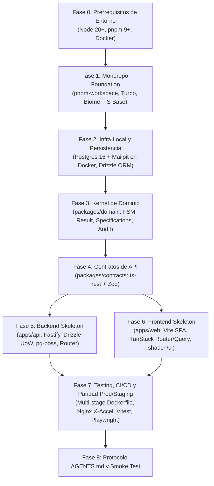

# Plan Maestro de Inicialización y Setup del Proyecto
**Proyecto:** Sistema de Titulación y Segunda Especialidad — FIPS / UNSA  
**Arquitectura:** Monorepo Modular Lean (Turborepo + pnpm)  
**Objetivo:** Establecer la base de código definitiva, configuración de herramientas, infraestructura local de base de datos, paquetes compartidos y esqueletos funcionales de Backend y Frontend con verificación continua (CI), guardrails para agentes de IA y **paridad estricta con producción/staging en local mediante Docker**.

---

## 1. Principios Rectores del Setup

1. **Orden de Dependencias Estricto (Bottom-Up):**  
   Primero se construyen las bases y contratos (`packages/`), luego la persistencia, y finalmente las aplicaciones consumidoras (`apps/api` y `apps/web`). Esto previene referencias circulares e inconsistencias de tipos.
2. **Estrategia Híbrida de Dockerización (El Estándar SOTA):**
   * **En Desarrollo Diario (`make dev`):**  
     * La infraestructura externa con estado (PostgreSQL 16 + Mailpit para emails) corre contenedorizada en Docker (`docker-compose.yml`).
     * Las aplicaciones (`apps/web`, `apps/api`) y herramientas (Biome, Vitest, TypeScript) corren **nativas en el Host**. Esto garantiza recarga instantánea HMR (<50ms), integración directa con el IDE y ciclos de feedback ultrarrápidos para los agentes de IA sin la sobrecarga de volúmenes de Docker.
   * **En Staging / Verificación Local (`make prod:local`):**  
     * **100% Dockerizado**: Nginx (puerto 80) sirviendo la SPA estática precompilada + Fastify en modo producción + PostgreSQL 16 + volumen persistente de documentos con `X-Accel-Redirect`.
     * Permite auditar exactamente el comportamiento del VPS de la UNSA antes de cualquier despliegue real.
3. **Determinismo y Reproducibilidad:**  
   Cero configuraciones manuales o pasos no versionados.
4. **Guardrails para Agentes de IA:**  
   Linter ultrarrápido (<100ms con Biome), tipado estricto sin excepciones (`strict: true`, `noImplicitAny`), y comandos atómicos verificables en cada paso.

---

## 2. Mapa de Fases de Inicialización

---

## 3. Desglose Detallado por Fases

### Fase 0: Verificación de Prerrequisitos del Sistema
* **Objetivo:** Asegurar que el entorno del host cuenta con los runtimes y herramientas requeridas.
* **Acciones:**
  1. Validar versiones mínimas: `node -v` (>=20.x LTS), `pnpm -v` (>=9.x), `docker --version` y `docker compose version`.
  2. Inicializar repositorio Git local con rama principal `main` y configuración de finales de línea (`.gitattributes`).

---

### Fase 1: Cimientos del Monorepo y Tooling Unificado
* **Objetivo:** Configurar el espacio de trabajo, orquestación de tareas y reglas de calidad globales.
* **Archivos a Crear/Configurar:**
  * `pnpm-workspace.yaml`: Definir `apps/*` y `packages/*`.
  * `package.json` raíz: Scripts globales (`dev`, `build`, `lint`, `format`, `test`, `typecheck`).
  * `turbo.json`: Pipelines con dependencias de tareas (`build` depende de `^build`, caché de compilación, outputs definidos).
  * `tsconfig.base.json`: Configuración estricta de TypeScript (`target: ES2022`, `module: NodeNext`, `moduleResolution: NodeNext`, `strict: true`, `noUncheckedIndexedAccess: true`).
  * `biome.json`: Configuración unificada de linter y formateador (reemplazo de ESLint/Prettier, sangrado a 2 espacios, reglas de orden de imports).
  * `.gitignore`: Excluir `node_modules`, `.turbo`, `dist`, `.env`, coberturas y temporales.
  * `.env.example`: Plantilla de variables para todo el monorepo.
  * `Makefile`: Comandos estándar:
    * `make install`: Instala dependencias con pnpm.
    * `make dev`: Levanta Postgres/Mailpit en Docker y ejecuta Vite + Fastify en el host.
    * `make prod:local`: Construye y levanta la emulación 100% fiel de producción en Docker (Nginx + API + DB).
    * `make prod:down`: Detiene los contenedores de staging/producción local.
    * `make test`: Ejecuta Vitest en todo el monorepo.
    * `make check`: Ejecuta Biome, typecheck y tests.
* **Hito de Verificación:** Ejecutar `pnpm install` y `pnpm lint` sin advertencias.

---

### Fase 2: Infraestructura Local de Desarrollo (`packages/db`)
* **Objetivo:** Proveer PostgreSQL 16 y Mailpit contenedorizados para dev y la capa de acceso a datos con Drizzle.
* **Archivos a Crear/Configurar:**
  * `docker-compose.yml`:
    * `postgres`: PostgreSQL 16 oficial con volumen local, puerto 5432 y healthcheck.
    * `mailpit`: Servidor SMTP mock local (puerto 1025 para Fastify, puerto 8025 con interfaz web para revisar correos enviados en dev sin enviar emails reales a usuarios).
  * `packages/db/package.json`: Paquete `@pis/db`.
  * `packages/db/drizzle.config.ts`: Configuración del generador de migraciones (`schema: ./src/schema/index.ts`, `out: ./drizzle`).
  * `packages/db/src/schema/`:
    * `enums.ts`: Estados del expediente (`REGISTRADO`, `EN_PLAN`, etc.), roles y modalidades.
    * `usuarios.ts`: Tabla de usuarios, roles y credenciales (DNI, CUI, email).
    * `expedientes.ts`: Tabla de expedientes con participante 1 y 2, asesor, programa.
    * `documentos.ts`: Metadatos de archivos subidos (ruta local, versión, hash SHA-256).
    * `auditoria-transiciones.ts`: Tabla append-only con encadenamiento criptográfico.
  * `packages/db/src/client.ts`: Pool de conexión con `pg` y cliente tipado de Drizzle.
  * `packages/db/src/seed.ts`: Carga de datos maestros (los 13 programas oficiales de FIPS, usuarios administrativos base: Angela, Magnolia, usuario tesista de prueba).
* **Hito de Verificación:** Levantar Postgres con `docker compose up -d`, ejecutar `pnpm --filter @pis/db db:push` y `pnpm --filter @pis/db db:seed`.

---

### Fase 3: Kernel de Dominio (`packages/domain`)
* **Objetivo:** Implementar la lógica de negocio pura, agnóstica de frameworks e I/O.
* **Archivos a Crear/Configurar:**
  * `packages/domain/package.json`: Paquete `@pis/domain`.
  * `packages/domain/src/shared/`:
    * `result.ts`: Monad `Result<T, E>`, funciones `ok()` y `fail()`.
    * `domain-error.base.ts`: Jerarquía de errores tipados.
    * `domain-event.base.ts`: Interfaz base para eventos de dominio.
  * `packages/domain/src/expediente/`:
    * `fsm.ts`: Máquina de estados formal (definición estricta de transiciones legales por etapa).
    * `dias-habiles.ts`: Función de cálculo de plazos descontando sábados, domingos y feriados nacionales oficiales de Perú.
    * `specifications/`: Especificación `ExpeditoParaSustentarSpecification` y validaciones de carátula.
    * `expediente.aggregate.ts`: Entidad raíz con registro de eventos de dominio.
  * `packages/domain/src/audit/`:
    * `cryptographic-trail.ts`: Utilidad de cálculo de hash encadenado SHA-256.
  * `packages/domain/__tests__/`:
    * Tests unitarios exhaustivos de la FSM, cálculo de días hábiles y Result pattern.
* **Hito de Verificación:** `pnpm --filter @pis/domain test` con 100% de tests passing en <100ms.

---

### Fase 4: Contratos de API Compartidos (`packages/contracts`)
* **Objetivo:** Establecer la fuente única de verdad entre Backend y Frontend mediante ts-rest y Zod.
* **Archivos a Crear/Configurar:**
  * `packages/contracts/package.json`: Paquete `@pis/contracts`.
  * `packages/contracts/src/enums.ts`: Re-exportación o definición de enums tipados.
  * `packages/contracts/src/expedientes.contract.ts`:
    * Schemas Zod de entrada y salida (`InscribirPlanSchema`, `ExpedienteDTOSchema`, `FiltrosExpedienteSchema`).
    * Contrato ts-rest con rutas REST (`inscribirPlan`, `getById`, `listar`).
  * `packages/contracts/src/auth.contract.ts`: Schemas de login (DNI/correo local y Google OAuth).
  * `packages/contracts/src/documentos.contract.ts`: Contrato de subida y metadatos.
* **Hito de Verificación:** `pnpm --filter @pis/contracts typecheck` pasando sin errores.

---

### Fase 5: Esqueleto del Backend (`apps/api`)
* **Objetivo:** Configurar el servidor HTTP Fastify desacoplado, modular y con integración de colas.
* **Archivos a Crear/Configurar:**
  * `apps/api/package.json`: Fastify, `@ts-rest/fastify`, `@fastify/cors`, `@fastify/helmet`, `pg-boss`.
  * `apps/api/src/server.ts`: Bootstrap, configuración de plugins de seguridad y registro de router ts-rest.
  * `apps/api/src/infra/`:
    * `db/client.ts` y `db/unit-of-work.ts`: Implementación del patrón Unit of Work sobre transacciones Drizzle.
    * `jobs/pg-boss.client.ts`: Inicialización de colas transaccionales nativas en Postgres.
    * `storage/local-storage.service.ts`: Gestión de archivos en volumen `/var/data/titulacion-docs`.
  * `apps/api/src/modules/expedientes/`:
    * `expedientes.routes.ts`: Implementación del contrato ts-rest con Fastify.
    * `expedientes.controller.ts`: Delegación a los casos de uso.
    * `use-cases/inscribir-plan/inscribir-plan.use-case.ts`: Primer caso de uso implementado con Result pattern.
    * `queries/get-expediente-by-id.query.ts`: Consulta de lectura directa.
    * `expedientes.repository.ts`: Métodos de persistencia del módulo.
  * `apps/api/src/modules/documentos/`:
    * Handler de descarga con emisión de cabecera `X-Accel-Redirect`.
* **Hito de Verificación:** Iniciar API en host con `pnpm --filter @pis/api dev` y verificar respuesta en `GET /health` y documentación OpenAPI viva en `/docs`.

---

### Fase 6: Esqueleto del Frontend (`apps/web`)
* **Objetivo:** Inicializar la SPA estática con Vite, tipado estricto de rutas y componentes base.
* **Archivos a Crear/Configurar:**
  * `apps/web/package.json`: Vite, React 19, `@tanstack/react-router`, `@tanstack/react-query`, `@ts-rest/react-query`, Tailwind CSS v4, Radix UI.
  * `apps/web/vite.config.ts`: Configuración con TanStack Router Vite Plugin.
  * `apps/web/index.html`: Entry point de la aplicación.
  * `apps/web/src/routes/`:
    * `__root.tsx`: Layout raíz con QueryClientProvider, Toaster y router outlet.
    * `_authenticated.tsx`: Guard de sesión de usuario.
    * `_authenticated/index.tsx`: Redirección por rol a panel correspondiente.
    * `_authenticated/expedientes/$id.tsx`: Vista de expediente con línea de tiempo visual.
    * `login.tsx`: Pantalla de inicio de sesión (DNI / Google UNSA).
  * `apps/web/src/components/ui/`: Instalación de primitivos shadcn/ui (Button, Dialog, Table, Badge, Card, Input).
  * `apps/web/src/components/domain/`:
    * `timeline-fsm.tsx`: Componente visual de etapas del expediente.
    * `semaforo-badge.tsx`: Indicador de días hábiles restantes (Verde, Amarillo, Rojo).
  * `apps/web/src/api/client.ts`: Cliente ts-rest configurado con React Query.
* **Hito de Verificación:** Iniciar con `pnpm --filter @pis/web dev` y renderizar pantalla de bienvenida y navegación tipada sin errores de consola.

---

### Fase 7: Testing, CI/CD y Paridad Staging/Producción en Local
* **Objetivo:** Automatizar la verificación continua y garantizar paridad exacta con el VPS de OTI/UNSA mediante Docker.
* **Archivos a Crear/Configurar:**
  * `vitest.workspace.ts`: Configuración para correr tests en todos los paquetes (`packages/*` y `apps/*`).
  * `e2e/playwright.config.ts`: Configuración para tests end-to-end contra web y api.
  * `e2e/tests/smoke.spec.ts`: Test básico de carga de login y navegación.
  * `.github/workflows/ci.yml`: Workflow que ejecuta en cada Pull Request:
    1. `pnpm install --frozen-lockfile`
    2. `pnpm biome check` (linter y formato)
    3. `pnpm typecheck` (verificación estricta de tipos de todo el monorepo)
    4. `pnpm test` (tests unitarios y de integración con Vitest)
  * **Infraestructura de Paridad de Producción / Staging Local (`deploy/`):**
    * `deploy/Dockerfile`: Multi-stage build:
      * *Stage 1 (Builder):* Compila contratos, base de datos, domain, compila la SPA con Vite (`dist/`) y construye el bundle de Fastify.
      * *Stage 2 (Runner API):* Imagen Alpine lean (~120 MB) con Node.js en producción para Fastify.
      * *Stage 3 (Runner Nginx):* Nginx Alpine con la SPA estática en `/usr/share/nginx/html`, configuración de compresión gzip/brotli y proxy hacia la API.
    * `deploy/nginx.conf`:
      * Sirve estáticos con caché agresivo.
      * Proxy reverso hacia `http://api:3001/api`.
      * Bloque `/protected-files/` con directiva `internal;` para procesar descargas seguras con `X-Accel-Redirect` desde el volumen `/var/data/titulacion-docs`.
    * `deploy/docker-compose.prod.yml`:
      * Orquesta la tríada de producción en tu máquina local: `nginx` (puerto 80), `api` (Fastify producción) y `postgres` (Postgres 16 con volumen).
* **Hito de Verificación (Gate de Paridad Local):**  
  Ejecutar `make prod:local` en tu máquina:
  1. El build multi-stage debe compilar sin errores.
  2. Al abrir `http://localhost`, Nginx debe servir la SPA compilada.
  3. Al solicitar una descarga protegida, Nginx debe procesar `X-Accel-Redirect` sin que el backend transmita el buffer en memoria.
  4. Ejecutar Playwright contra el entorno de producción local: `pnpm playwright test --config=e2e/playwright.config.ts`.

---

### Fase 8: Protocolo de Codificación para Agentes de IA (`AGENTS.md`)
* **Objetivo:** Redactar la guía de conducta, estándares y restricciones que deberán acatar todos los agentes que escriban código en el proyecto.
* **Contenido de `AGENTS.md`:**
  * Estructura del monorepo y reglas de importación entre paquetes.
  * Flujo de trabajo obligatorio: `make dev` para codificar $\rightarrow$ `make check` para validar tipos/tests $\rightarrow$ `make prod:local` antes de abrir PR.
  * Patrón obligatorio para Use Cases (Result Pattern, Unit of Work, FSM check).
  * Prohibiciones explícitas (no usar `any`, no lanzar excepciones de negocio, no modificar tablas de BD sin migración Drizzle, no usar Redis ni MinIO).

---

## 4. Matriz de Entregables y Comandos de Verificación (DoD)

| Fase | Entregable Principal | Comando de Verificación |
|---|---|---|
| **1. Tooling** | Workspace pnpm + Turbo + Biome | `pnpm lint && pnpm format` |
| **2. Persistencia Dev** | PostgreSQL 16 + Mailpit en Docker + Drizzle + Seed | `pnpm --filter @pis/db db:push` |
| **3. Dominio** | FSM + Días Hábiles + Result Pattern | `pnpm --filter @pis/domain test` |
| **4. Contratos** | Schemas Zod + ts-rest Contracts | `pnpm --filter @pis/contracts typecheck` |
| **5. Backend Dev** | Fastify + 1 Use Case + OpenAPI | `curl -f http://localhost:3001/health` |
| **6. Frontend Dev** | Vite SPA + TanStack Router + shadcn | `pnpm --filter @pis/web build` |
| **7. CI/Testing** | Vitest + Playwright + GitHub Workflow | `make check` (100% verde) |
| **8. Paridad Prod/Staging** | Docker multi-stage + Nginx `X-Accel` en local | `make prod:local` (test E2E en puerto 80) |
| **9. Protocolo** | `AGENTS.md` y `Makefile` completos | `make check` exitoso en <10s |
