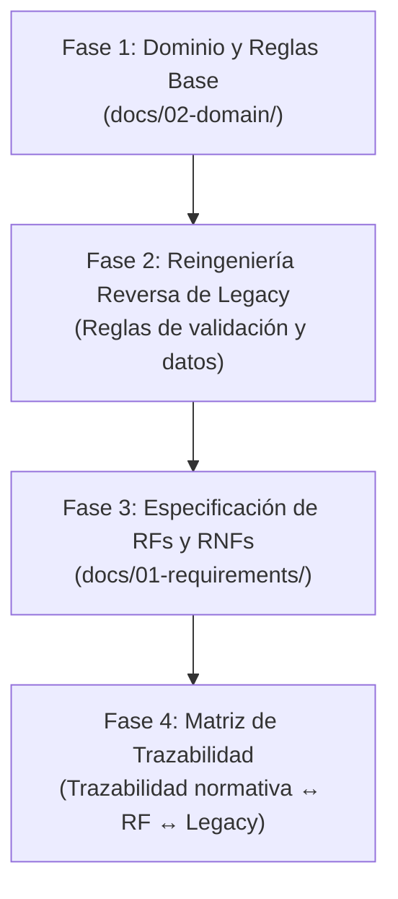

# Plan Maestro de Elicitación y Especificación de Requisitos
**Proyecto:** Sistema de Titulación y Segunda Especialidad — FIPS / UNSA  
**Destinatario:** Agente de Elicitación y Análisis de Software  
**Objetivo:** Transformar el conjunto heterogéneo de fuentes documentales, prototipos de interfaz, transcripciones de entrevistas y código legacy en una especificación formal, exhaustiva y estructurada de **Requerimientos Funcionales (RF)**, **Requerimientos No Funcionales (RNF)** y **Modelos de Dominio** dentro de `docs/`.

---

## 1. Inventario y Rol de Fuentes de Información

El agente de elicitación no debe asumir nada. Debe triangular y contrastar rigurosamente las siguientes 6 fuentes:

| Fuente | Tipo | Rol en la Elicitación | Aspectos Clave a Extraer |
|---|---|---|---|
| **`3EB08E014CAB3BC9961B96-TALLER TITULACION USE FIPS.pdf`** | Normativa Oficial | **Marco Legal e Institucional** | Las 7 etapas formales, documentos exigidos por modalidad (Tesis, Trabajo Académico, Artículo), plazos legales máximos, instancias de aprobación (Terna, Consejo de Facultad, Decano, SUNEDU). |
| **`3EB06D7AA67FA1C8FE66BF-Historias de usuario_1.pdf`** | Requisitos Preliminares | **Expectativas de Usuarios** | Casos de uso identificados previamente, actores tipificados y expectativas iniciales de los estudiantes y administrativos. |
| **`3EB0EC327469963279D237-INTERFACES (1)_1.pdf`** | Mockups / UI | **Contrato Visual y de Datos** | Campos de entrada exactos por formulario, botones de acción, filtros de tablas, estados visuales (semáforos), vistas por rol y estructura de navegación. |
| **`Entrevista 1 Sep 8, 14.17.docx.md`** y **`RESUMEN_...`** | Entrevistas a Usuarios | **Realidad Operativa y Puntos de Dolor** | Cuellos de botella reales: errores constantes en carátulas, analfabetismo digital de egresados antiguos, atrasos en jurados, asignación de fechas de sustentación, roles operativos reales (Srta. Angela, Sra. Magnolia, Srta. Marietha). |
| **`legacy-code/`** (135 archivos JS/GAS) | Código en Producción | **La Fuente de Verdad Técnica Oculta** | Reglas de negocio no escritas, validaciones de backend, nombres reales de columnas en Google Sheets, triggers automáticos, validaciones de modalidad y estados intermedios. |

---

## 2. Mapa de Arqueología de `legacy-code/` (Archivos Críticos)

Para no perder tiempo leyendo 135 archivos, el agente debe priorizar la inspección de estos módulos clave:

1. **Modelado y Estados:**
   * `legacy-code/05_Domain_Expediente.js` $\rightarrow$ Entidad central de expediente y métodos de transición.
   * `legacy-code/WorkflowEtapas.js` $\rightarrow$ Flujo entre etapas y subetapas.
   * `legacy-code/SeguimientoSubetapas.js` $\rightarrow$ Lista exhaustiva de subetapas y estados reales en producción.
2. **Esquema de Base de Datos y Metadatos:**
   * `legacy-code/42_BD_EsquemaRelacionalV2.js` y `40_BD_MetadataV1.js` $\rightarrow$ Estructura relacional emulada en Sheets.
   * `legacy-code/95_BD_DatosMaestrosV188.gs.js` y `96_BD_ProgramasOficialesV189.gs.js` $\rightarrow$ Catálogos oficiales y programas.
3. **Gestión Documental y Plantillas:**
   * `legacy-code/97_BD_DocumentosFormatoModalidadV1811.gs.js` $\rightarrow$ Lista exacta de anexos requeridos por modalidad.
   * `legacy-code/99_BD_CaratulaModFTextoV1813.gs.js` $\rightarrow$ Reglas de validación y formateo de la carátula oficial.
   * `legacy-code/DocumentosExpedientes.js` $\rightarrow$ Lógica de carga y versionado de documentos en Google Drive.
4. **Agendamiento y Sustentación:**
   * `legacy-code/81_BD_AgendaWorkflowV17.js` $\rightarrow$ Lógica de coordinación de fechas de sustentación con la terna.
5. **Autenticación y Roles:**
   * `legacy-code/21_AuthUsuariosRepositoriesV6.js` y `90_BD_LoginTesistaFixV181.js` $\rightarrow$ Manejo de credenciales, CUI y roles.

---

## 3. Metodología de Elicitación (Paso a Paso)

El agente debe ejecutar la elicitación en **4 fases secuenciales**:



### Fase 1: Dominio y Reglas Base (`docs/02-domain/`)
1. **`glossary.md`:** 
   * Extraer y definir todos los términos del lenguaje ubicuo: *Expediente, Terna, Dictamen, Decreto, Borrador, Visto Bueno, Similitud Turnitin, SISGRAD, Modalidad (Tesis / Trabajo Académico / Artículo)*.
2. **`state-machine.md`:**
   * Reconciliar los estados formales del PDF del Taller con los estados reales descubiertos en `legacy-code/SeguimientoSubetapas.js`.
   * Modelar la FSM completa en diagramas Mermaid con eventos de entrada, guardas y estados resultantes.
3. **`permissions-matrix.md`:**
   * Mapear la matriz ABAC: Actor $\times$ Rol $\times$ Estado del Expediente $\rightarrow$ Acciones permitidas.
4. **`calendar-rules.md`:**
   * Extraer todos los plazos estipulados (días hábiles para revisión de terna, días para subsanación, días para dictamen, etc.) y las reglas para fines de semana y feriados.

---

### Fase 2: Requerimientos Funcionales (`docs/01-requirements/functional/`)
Crear un archivo markdown por cada hito legal del proceso:

* `RF-01-inscripcion-plan.md`: Elección de modalidad, asesor, carga de anexos (17, 18, 33), validación de 2 años de experiencia si es Trabajo Académico, autogeneración de carátula normalizada.
* `RF-02-evaluacion-plan.md`: Asignación de terna, revisión formal (Srta. Angela), emisión de observaciones (3–5 días), levantamiento de observaciones (2–5 días), emisión de Decreto de Aprobación.
* `RF-03-borrador-tesis.md`: Visto bueno de culminación del asesor (Anexo 8), solicitud de titulación (Anexo 27), constancias de no adeudo (biblioteca, pensiones), libreta de notas, foto JPG.
* `RF-04-dictamen-jurados.md`: Sorteo de jurados por secretaría, resolución decanal, revisión del borrador (15–20 días), emisión de dictámenes individuales (Favorable / Observado), levantamiento de observaciones.
* `RF-05-sustentacion.md`: Propuesta de terna de fechas por el tesista, confirmación de fecha/hora definitiva, publicación de citación oficial, registro de acta de sustentación y dictamen de jurados.
* `RF-06-validaciones-turnitin.md`: Envío a OTI, verificación de reporte Turnitin (<20%), informe de similitud firmado por Unidad de Investigación, registro en Repositorio Institucional y validación de URL.
* `RF-07-grados-titulos-sunedu.md`: Informe de Secretaría Académica, dictamen de Comisión de Grados y Títulos, Resolución de Consejo de Facultad, verificación en SISGRAD, firma del Decano y registro en SUNEDU.

---

### Fase 3: Requerimientos No Funcionales (`docs/01-requirements/non-functional/`)
Extraer y redactar formalmente los requerimientos de calidad basados en el stack seleccionado y las restricciones:

* `RNF-01-seguridad-privacidad.md`: Control de acceso estricto (CASL), autenticación híbrida (DNI/correo + Google OAuth), protección de documentos mediante `X-Accel-Redirect`, cadena de custodia con hash criptográfico SHA-256 en auditoría.
* `RNF-02-rendimiento-recursos.md`: Huella de memoria en reposo <350MB en VPS, entrega de estáticos vía Nginx con latencia <50ms, consultas optimizadas con índices Postgres, streaming de PDFs directo a disco.
* `RNF-03-disponibilidad-backup.md`: Respaldo diario automatizado (pg_dump + archivo comprimido de volumen de documentos), retención de 30 días, recuperación RTO < 1 hora, RPO < 24 horas.
* `RNF-04-usabilidad-accesibilidad.md`: Interfaz guiada tipo wizard/stepper para egresados con baja alfabetización digital, semáforos de plazos de alta legibilidad, cumplimiento de accesibilidad WCAG 2.1 AA.

---

### Fase 4: Matriz de Trazabilidad (`docs/01-requirements/traceability-matrix.md`)
Elaborar una tabla cruzada que garantice que ningún requisito legal o del legacy quede huérfano:
$$\text{Etapa Legal (Taller)} \longleftrightarrow \text{Pantalla (Mockup)} \longleftrightarrow \text{Módulo Legacy} \longleftrightarrow \text{RF ID} \longleftrightarrow \text{Use Case Técnico}$$

---

## 4. Estándar de Redacción para cada Requerimiento Funcional (Plantilla Obligatoria)

El agente debe utilizar estrictamente esta estructura para cada archivo `RF-XX-*.md`:

```markdown
# RF-XX: [Nombre del Requerimiento]

## 1. Identificación y Metadatos
* **ID:** RF-XX
* **Etapa Legal Asociada:** Etapa X (según Taller USE FIPS)
* **Prioridad:** Alta (Core) / Media / Baja
* **Actores Involucrados:** [Actor Principal], [Actores Secundarios]

## 2. Descripción del Requisito
[Descripción clara, concisa y sin ambigüedades de lo que el sistema debe hacer]

## 3. Precondiciones
* [Estado requerido del expediente según la FSM]
* [Condiciones de rol, autenticación o documentos previos]

## 4. Entradas, Validaciones y Reglas de Negocio
* **Entradas:** [Campos de datos, tipos, obligatoriedad - cruzados con Mockups e interfaces]
* **Reglas de Negocio (RN):**
  * **RN-XX.1:** [Regla específica, ej. plazo de 5 días hábiles según reglamento]
  * **RN-XX.2:** [Validación extraída del código legacy, ej. formato de carátula o modalidad]
* **Salidas:** [Cambio de estado, documentos generados, eventos emitidos]

## 5. Criterios de Aceptación (Formato Gherkin)
```gherkin
Escenario: [Flujo exitoso principal]
  Dado que [precondición de estado y actor]
  Cuando [el usuario ejecuta la acción con datos válidos]
  Entonces [el sistema muta el estado a X]
  Y [se encola el evento / notificación Y]
  Y [se registra la auditoría con hash Z]

Escenario: [Flujo alternativo o de error]
  Dado que [condición]
  Cuando [...]
  Entonces [el sistema rechaza la acción con DomainError tipado]
```

## 6. Mapeo con Artefactos
* **Pantallas Mockup:** [Página o componente del PDF de Interfaces]
* **Referencia Legacy:** [Archivo y función en legacy-code/ donde se originó la regla]
* **Caso de Uso Técnico:** `[Nombre]UseCase` (`apps/api/src/modules/...`)
```

---

## 5. Criterios de Aceptación del Proceso de Elicitación (Definition of Done)

El trabajo de elicitación se considerará terminado y exitoso cuando:
1. Todos los archivos de `docs/01-requirements/functional/` y `docs/01-requirements/non-functional/` existan y sigan la plantilla estandarizada.
2. Cada regla de negocio extraída del código legacy (`legacy-code/`) esté documentada explícitamente en el RF correspondiente.
3. Los puntos de dolor de las entrevistas (carátulas normalizadas, plazos de jurados, fechas de sustentación) tengan un RF explícito que los solucione.
4. El archivo `docs/01-requirements/traceability-matrix.md` esté 100% completo, sin vacíos ni etapas huérfanas.
5. Los archivos de `docs/02-domain/` definan el glosario y la FSM sin inconsistencias lógicas.
