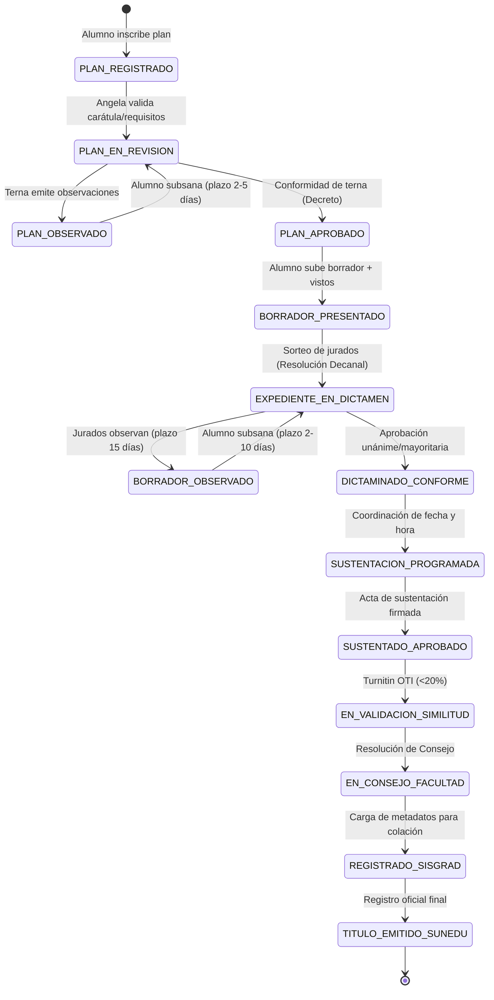

# Análisis Arquitectónico Definitivo: Stack y Patrones de Diseño — Sistema de Titulación FIPS/USE

## 1. Restricciones Reales del Sistema (Ancladas en el Dominio FIPS/UNSA)

Cualquier decisión arquitectónica debe responder a las restricciones operativas y normativas extraídas de las entrevistas y reglamentos de la facultad:

| # | Restricción del Dominio | Implicación Técnica y Arquitectónica |
|---|---|---|
| **R1** | **Workflow legal de 7 etapas con plazos en días hábiles** (ej. 3 a 5 días para plan, 15 días para borrador). | Motor de Máquina de Estados Finita (FSM) estricto. Cálculo de días hábiles descontando feriados nacionales. |
| **R2** | **10 a 12 documentos por expediente** (Tesis de 20–50MB, anexos, dictámenes, actas, comprobantes). | Almacenamiento directo en disco local del VPS servido mediante Nginx con descargas protegidas (`X-Accel-Redirect`). El backend nunca retiene buffers pesados en memoria RAM. |
| **R3** | **Cuello de botella #1: Errores constantes en carátulas y merge manual de documentos** (Google Apps Script / Docs). | Servicio automatizado de generación documental (PDFs con QR y hash criptográfico), con opción de compilar localmente o delegar a Google Docs API para ahorrar CPU. |
| **R4** | **Usuarios heterogéneos y baja alfabetización digital** (egresados antiguos de Segunda Especialidad vs. secretarias y jurados). | UI tipo Wizard/Stepper guiado y determinista. Autenticación híbrida (DNI/correo + Google OAuth institucional `@unsa.edu.pe`). |
| **R5** | **Infraestructura limitada** (VPS de OTI / UNSA con recursos modestos: 2–4 GB de RAM). | **Arquitectura Lean**: cero servicios redundantes (eliminación de Redis y MinIO). Consumo total en reposo < 300 MB de RAM. |
| **R6** | **Trazabilidad y fe pública universitaria** (Resoluciones de Consejo, Decretos, SUNEDU). | Historial append-only inmutable en PostgreSQL. Transacciones ACID obligatorias en cada transición. |
| **R7** | **Codificación y mantenimiento asistido por Agentes de IA**. | Tipado estricto end-to-end (Zod + TypeScript), contratos REST desacoplados (ts-rest/OpenAPI), feedback de linter/test < 3s, cero ambigüedad entre servidor/cliente. |

---

## 2. Reevaluación Comparativa de Stack Tecnológico

### 2.1 Frontend Framework: ¿Por qué Vite + React 19 (SPA) vence a Next.js 15?

En el análisis preliminar se sugirió Next.js 15 por inercia de mercado. Sin embargo, someter la decisión a las restricciones R4, R5 y R7 demuestra que una **SPA pura** es técnicamente superior para este caso.

| Criterio | **Vite + React 19 (SPA)** | **Next.js 15 (App Router)** | **Astro 5** | **Nuxt 4 / SvelteKit** |
|---|:---:|:---:|:---:|:---:|
| **Necesidad real de SEO** | **No aplica** (Intranet 100% autenticada) | No aplica (Innecesario) | No aplica (Innecesario) | No aplica |
| **Consumo de RAM en el VPS** | **~0 MB** (Nginx sirve archivos estáticos precompilados) | **250–400 MB** (Proceso Node.js permanente renderizando SSR) | 150–250 MB (si usa SSR en modo server) | 200–300 MB |
| **Ergonomía para Agentes de IA** | **Excelente**: Código React estándar, determinista, sin ambigüedades de hidratación ni serialización. | **Media/Baja**: Fricción constante con directivas `'use client'`, cambios en APIs asíncronas (`cookies()`, `params`) y bugs de hidratación. | Media: Mezcla de sintaxis de islas y framework hijo. | Buena en Nuxt; Media en SvelteKit (runes confunden a LLMs). |
| **Manejo de Formularios y Modales Complejos** | **Excelente**: TanStack Router gestiona estados en URL tipados; TanStack Query maneja caché y mutaciones. | Complejo: Server Actions no están diseñadas para flujos de formularios multipaso con validación en vivo. | Pobre en flujos 100% reactivos. | Bueno. |
| **Velocidad de compilación y feedback** | **Instantáneo** (Vite HMR en <50ms) | Lento (Turbopack/Webpack consume mucha CPU/RAM en dev) | Rápido | Rápido |

> [!IMPORTANT]
> ### Veredicto Frontend: **Vite + React 19 (SPA) + TanStack Router + TanStack Query + shadcn/ui**
> Next.js App Router añade complejidad accidental (SSR, Server Components, caché de servidor agresiva) que no aporta ningún valor a una intranet académica cerrada y sobrecarga el VPS universitario. La SPA servida por Nginx ofrece latencia cero, máxima estabilidad para agentes y cero consumo de memoria de renderizado en el servidor.

---

### 2.2 Backend Framework: Fastify standalone con `ts-rest`

| Criterio | **Fastify + ts-rest** | **NestJS** | **Hono (Node)** | **FastAPI (Python)** |
|---|:---:|:---:|:---:|:---:|
| **Rendimiento I/O** | **Líder en Node.js** (~77k req/s) | Medio (~25k req/s por overhead de interceptors) | **Excelente** (~75k req/s) | Excelente (~50k req/s) |
| **Simplicidad para Agentes de IA** | **Excelente**: Funciones puras tipadas. Cero decoradores, cero contenedores DI opacos. | Pobre: Los agentes olvidan decoradores de inyección o generan ciclos circulares. | Excelente: Muy minimalista. | Buena, pero rompe la cadena de tipos TS. |
| **Contratos y OpenAPI** | **ts-rest**: 1 solo contrato Zod genera tipos para cliente y servidor + OpenAPI estándar para SISGRAD/UNSA. | Decoradores `@ApiProperty` duplicados de los DTOs. | RPC nativo bueno, pero OpenAPI requiere configuración extra. | Pydantic genera OpenAPI nativo. |
| **Huella de memoria** | **Mínima** (~45–70 MB en reposo) | Pesada (~150–220 MB por reflection y metadata) | Mínima (~40 MB) | Media (~90 MB) |

> [!IMPORTANT]
> ### Veredicto Backend: **Fastify (standalone) + ts-rest**
> Proporciona la velocidad de ejecución más alta de Node.js, contratos tipados unificados con el frontend y una especificación OpenAPI viva sin el peso ni la sobre-abstracción de clases y decoradores de NestJS.

---

### 2.3 Base de Datos y ORM: PostgreSQL 16 + Drizzle ORM

* **Base de Datos:** **PostgreSQL 16+**. Indiscutible. Soporte de tipos `ENUM` para estados de expediente, campos `JSONB` con índices GIN para metadatos documentales, transacciones ACID estrictas y extensiones de búsqueda (`pg_trgm`) para nombres de alumnos y títulos de tesis.
* **ORM:** **Drizzle ORM**. Se descarta Prisma debido a que su motor binario en Rust añade 50–150 MB de consumo de memoria, cold starts lentos y un DSL propietario que dificulta queries complejas. Drizzle es TypeScript puro con sintaxis SQL explícita, ideal para que los agentes escriban consultas optimizadas sin alucinaciones.

---

### 2.4 Procesamiento Asíncrono y Colas: ¿Por qué PostgreSQL Nativo (`pg-boss`) destruye a Redis + BullMQ?

El análisis inicial propuso Redis + BullMQ. En este dominio (300 a 800 expedientes al año, ~3 mutaciones al día), **Redis es una complicación injustificada**.

| Criterio | **PostgreSQL Nativo (`pg-boss`)** | **Redis + BullMQ** |
|---|:---:|:---:|
| **Atomicidad Transaccional** | **100% ACID Nativa**: El cambio de estado del expediente y la tarea (ej. enviar correo o generar acta) se registran en la **misma transacción de base de datos**. Si la transacción falla, el correo nunca se encola. | **No atómica**: Requiere implementar un *Transactional Outbox Pattern* manual para evitar que un fallo entre Postgres y Redis desincronice el sistema. |
| **Servicios a mantener en VPS** | **0 servicios extra** (Utiliza la base de datos PostgreSQL existente mediante `SKIP LOCKED`). | **1 servidor extra** (Redis daemon, configuración de persistencia RDB/AOF, monitoreo). |
| **Consumo de memoria RAM** | **0 MB extra** en el sistema. | 50–120 MB de RAM dedicados a Redis. |
| **Capacidad de procesamiento** | Miles de tareas/minuto (el sistema requiere ~10 tareas al día). | Cientos de miles de tareas/segundo (sobredimensionado 1000x). |

> [!IMPORTANT]
> ### Veredicto Colas: **PostgreSQL Nativo (`pg-boss`)**
> Elimina Redis del proyecto. Otorga transaccionalidad atómica perfecta y reduce a cero el mantenimiento de infraestructura adicional.

---

### 2.5 Motor de Generación Documental (Solución al Cuello de Botella Operativo)

El problema operativo número uno identificado en las entrevistas es el tiempo perdido por la Srta. Angela y la Sra. Magnolia revisando carátulas con nombres mal escritos, formatos no oficiales y el merge manual en Google Docs.

#### Arquitectura del Generador Documental:
1. **Generación Programática Oficial:** El sistema genera los documentos clave en formato PDF de forma automática:
   * Carátula normalizada (validada contra DNI y registro SUNEDU del asesor).
   * Anexos oficiales (17, 18, 27, 32, etc.).
   * Decretos de aprobación de plan y actas de sustentación con código QR de verificación de autenticidad.
2. **Estrategia Dual de Renderizado:**
   * **Motor Ligero en Backend:** Uso de **Typst** (compilador nativo ultrarrápido escrito en Rust, consume <15MB RAM y genera PDFs de calidad tipográfica en milisegundos) o **`@react-pdf/renderer`**.
   * **Adaptador Google Docs API (Opcional para ahorro de CPU):** Permite aprovechar las plantillas institucionales preexistentes en Google Workspace delegando el merge y la exportación a PDF a la nube de Google mediante una Service Account institucional, dejando la CPU del VPS completamente libre.

---

### 2.6 Estrategia de Almacenamiento de Archivos (PDFs)

* **Ubicación:** **Disco local del VPS** montado en un volumen persistente (`/var/data/titulacion-docs/`).
* **Mecanismo de Entrega Segura (Nginx `X-Accel-Redirect`):**
  1. El cliente solicita descargar un documento: `GET /api/documentos/:id/descargar`.
  2. Fastify autentica al usuario y valida con CASL si tiene permiso para ver ese documento en el estado actual del expediente.
  3. Fastify responde con un encabezado HTTP: `X-Accel-Redirect: /protected-files/exp_102/tesis_v2.pdf`.
  4. Nginx intercepta este encabezado y transmite el archivo directamente desde el disco al cliente a velocidad de socket nativo.
  * **Resultado:** El proceso Node.js gasta **cero memoria RAM** transmitiendo PDFs de 50MB y los archivos jamás están expuestos públicamente.

---

### 2.7 Autenticación y Autorización

* **Motor:** **Better-Auth** integrado en Fastify con persistencia en PostgreSQL.
* **Estrategia Híbrida:**
  * **Acceso Local (DNI / Correo personal + Contraseña):** Soporta a egresados antiguos de Segunda Especialidad que ya no tienen activa su cuenta universitaria.
  * **Google Workspace OAuth (`@unsa.edu.pe`):** Acceso en un clic para docentes (asesores, jurados) y personal administrativo activo.
* **Control de Acceso (CASL):**
  * Matriz de permisos dinámica que evalúa: **Rol + Estado del Expediente + Asignación**.
  * *Ejemplo:* Un usuario con rol `DOCENTE` solo puede emitir dictamen si `expediente.estado === 'EN_DICTAMEN'` Y `expediente.jurados.includes(docente.id)`.

---

## 3. Presupuesto de Recursos en el VPS (Comparativa de Eficiencia)

| Componente | Arquitectura Tradicional (SaaS Genérico) | Arquitectura Lean SOTA (Seleccionada) |
|---|:---:|:---:|
| **Frontend Runtime** | 300 MB (Next.js Node server) | **0 MB** (Nginx estático) |
| **Backend Runtime** | 180 MB (NestJS) | **65 MB** (Fastify standalone) |
| **Base de Datos** | 120 MB (PostgreSQL 16) | **120 MB** (PostgreSQL 16) |
| **Colas / Cache** | 80 MB (Redis daemon) | **0 MB** (Integrado en Postgres vía `pg-boss`) |
| **Object Storage** | 150 MB (Contenedor MinIO) | **0 MB** (Disco local + Nginx `X-Accel`) |
| **Reverse Proxy** | 20 MB (Nginx) | **20 MB** (Nginx) |
| **TOTAL RAM APROX.** | **~850 MB – 1.2 GB** | **~200 MB – 250 MB** |

> [!TIP]
> La arquitectura seleccionada consume **una cuarta parte de los recursos**, dejando el 80% de la memoria del VPS libre para el sistema operativo y picos de tráfico en fechas de cierre de semestre.

---

## 4. Patrones de Diseño Definitivos: De la Convención al Nivel de Excelencia

Para garantizar mantenibilidad a largo plazo, trazabilidad legal y código limpio, el sistema adopta una **Arquitectura Guiada por Casos de Uso (Use-Case Driven Architecture)** sobre un **Kernel de Dominio enriquecido**, respaldada por 6 patrones de ingeniería de software de alto nivel:



### 4.1 Separación Estricta en 3 Capas (Transport $\rightarrow$ Use Cases $\rightarrow$ Domain/Persistence)
Se destierran tanto los "archivos bolsa" (`commands.ts` de 1000 líneas) como los scripts informales (`inscribir-plan.handler.ts`):
* **Transport (`*.routes.ts`, `*.controller.ts`):** Maneja HTTP, status codes y contratos ts-rest/Zod. Agnóstico del negocio.
* **Application Use Cases (`use-cases/[accion]/[accion].use-case.ts`):** Un archivo y test por caso de uso (`InscribirPlanUseCase`, `EmitirDictamenUseCase`). Cumple el Principio de Responsabilidad Única (SRP) y previene conflictos en Git.
* **Domain Kernel (`packages/domain`):** Lógica pura sin dependencias de I/O, compartida entre Frontend y Backend.

### 4.2 Control de Errores Tipado: *Railway-Oriented Programming (Result Pattern)*
Se eliminan las excepciones (`throw new Error`) para flujo de negocio. Errores legales (plazo vencido, turnitin no conforme, jurado no asignado) se modelan con el tipo monádico `Result<T, DomainError>`. El compilador de TypeScript fuerza a los controladores a cubrir todas las ramas posibles, eliminando errores 500 no controlados.

### 4.3 Desacoplamiento de Efectos Secundarios: *Domain Events en el Agregado*
El agregado `Expediente` no llama directamente a servicios de correo o generadores de PDFs. Al mutar su estado, encola **Domain Events** (`PlanAprobadoEvent`, `DictamenEmitidoEvent`). Al confirmarse la transacción de base de datos, listeners asíncronos procesan los efectos secundarios de forma idempotente vía `pg-boss`.

### 4.4 Encapsulación de Reglas Complejas: *Specification Pattern*
Validaciones legales compuestas (ej. *"¿Está expedito para sustentar?"* que requiere 3 dictámenes conformes, 0 deudas en biblioteca, 0 pensiones pendientes) se encapsulan en clases `Specification<T>` reutilizables y comprobables en memoria en 2 milisegundos.

### 4.5 Fe Pública y Trazabilidad: *Cadena de Custodia Criptográfica (SHA-256 Hash Chaining)*
Para auditorías de SUNEDU y Consejo de Facultad, cada transición en `auditoria_transiciones` calcula un hash SHA-256 encadenando el registro anterior con el hash del PDF, el actor y el nuevo estado ($\text{Hash}_n = \text{SHA256}(\text{Hash}_{n-1} + \dots)$), garantizando matemáticamente la no-alteración retroactiva.

### 4.6 Transaccionalidad Limpia: *Unit of Work (UoW) Pattern*
Abstrae la transacción de base de datos de Drizzle, asegurando que la actualización del expediente, el registro de auditoría criptográfica y el encolado del job en `pg-boss` ocurran en un único `COMMIT` atómico sin ensuciar la capa de aplicación con SQL.

---

## 5. Estructura de Directorios del Monorepo (Definitiva)

```text
pis-titulacion/
├── apps/
│   ├── web/                                # 🌐 FRONTEND: Vite + React 19 SPA
│   │   ├── public/                         # Favicon, logo oficial UNSA
│   │   ├── index.html                      # Entry point de Vite
│   │   ├── src/
│   │   │   ├── routes/                     # TanStack Router (File-based, 100% tipado)
│   │   │   │   ├── __root.tsx              # Layout raíz, QueryClient, AuthProvider
│   │   │   │   ├── _authenticated.tsx      # Guard de sesión (redirige a /login)
│   │   │   │   ├── _authenticated/
│   │   │   │   │   ├── index.tsx           # Dashboard / redirección según rol
│   │   │   │   │   ├── expedientes/
│   │   │   │   │   │   ├── index.tsx       # Tabla de expedientes con filtros
│   │   │   │   │   │   ├── $id.tsx         # Detalle, timeline FSM y documentos
│   │   │   │   │   │   └── nuevo.tsx       # Wizard multipaso de inscripción
│   │   │   │   │   └── dictamenes/
│   │   │   │   │       └── index.tsx       # Bandeja de revisión para jurados
│   │   │   │   └── login.tsx               # Login híbrido (DNI + Google OAuth)
│   │   │   │
│   │   │   ├── api/                        # Cliente ts-rest + hooks de TanStack Query
│   │   │   │   ├── client.ts               # Instancia configurada de ts-rest
│   │   │   │   ├── expedientes.queries.ts  # useExpedienteQuery, useListExpedientesQuery
│   │   │   │   ├── expedientes.mutations.ts# useInscribirPlanMutation, etc.
│   │   │   │   └── auth.queries.ts
│   │   │   │
│   │   │   ├── components/
│   │   │   │   ├── ui/                     # Primitivos shadcn/ui (Button, Dialog, Table)
│   │   │   │   └── domain/                 # Componentes del negocio universitario
│   │   │   │       ├── timeline-fsm.tsx    # Semáforo visual y etapas del trámite
│   │   │   │       ├── semaforo-badge.tsx  # Días hábiles restantes (Verde/Amarillo/Rojo)
│   │   │   │       └── expediente-card.tsx
│   │   │   │
│   │   │   ├── hooks/                      # Hooks genéricos de UI (useDebounce, etc.)
│   │   │   ├── stores/                     # Estado cliente mínimo (auth, tema)
│   │   │   └── utils/                      # Formateadores de moneda, fecha y DNI
│   │   │
│   │   ├── tailwind.config.ts
│   │   ├── vite.config.ts
│   │   └── package.json
│   │
│   └── api/                                # ⚙️ BACKEND: Fastify standalone
│       ├── src/
│       │   ├── modules/                    # 📦 MÓDULOS DE NEGOCIO (Por Bounded Context)
│       │   │   ├── expedientes/
│       │   │   │   ├── expedientes.routes.ts     # Definición de rutas Fastify / ts-rest
│       │   │   │   ├── expedientes.controller.ts # Mapeo HTTP (req, res) $\rightarrow$ Use Cases
│       │   │   │   ├── use-cases/                # 1 carpeta/archivo por caso de uso
│       │   │   │   │   ├── inscribir-plan/
│       │   │   │   │   │   ├── inscribir-plan.use-case.ts
│       │   │   │   │   │   └── inscribir-plan.use-case.spec.ts
│       │   │   │   │   ├── aprobar-plan/
│       │   │   │   │   │   ├── aprobar-plan.use-case.ts
│       │   │   │   │   │   └── aprobar-plan.use-case.spec.ts
│       │   │   │   │   ├── sortear-jurados/
│       │   │   │   │   │   ├── sortear-jurados.use-case.ts
│       │   │   │   │   │   └── sortear-jurados.use-case.spec.ts
│       │   │   │   │   └── emitir-dictamen/
│       │   │   │   │       ├── emitir-dictamen.use-case.ts
│       │   │   │   │       └── emitir-dictamen.use-case.spec.ts
│       │   │   │   ├── queries/                  # CQRS: Lecturas optimizadas en SQL
│       │   │   │   │   ├── get-expediente-by-id.query.ts
│       │   │   │   │   └── list-expedientes.query.ts
│       │   │   │   ├── workers/                  # Background jobs específicos del módulo
│       │   │   │   │   ├── notificar-dictamen.worker.ts
│       │   │   │   │   └── verificar-plazos.worker.ts # Cron de días hábiles
│       │   │   │   └── expedientes.repository.ts # Operaciones Drizzle del módulo
│       │   │   │
│       │   │   ├── documentos/
│       │   │   │   ├── documentos.routes.ts
│       │   │   │   ├── documentos.controller.ts
│       │   │   │   ├── use-cases/
│       │   │   │   │   └── upload-documento/
│       │   │   │   └── queries/
│       │   │   │       └── download-accel.query.ts # Emite cabecera X-Accel-Redirect
│       │   │   │
│       │   │   └── auth/
│       │   │       ├── auth.routes.ts
│       │   │       ├── auth.controller.ts
│       │   │       └── use-cases/
│       │   │           ├── login-local.use-case.ts
│       │   │           └── login-google.use-case.ts
│       │   │
│       │   ├── services/                   # 📄 SERVICIOS DE APLICACIÓN TRANSVERSALES
│       │   │   └── generador-docs/
│       │   │       ├── plantillas/             # Plantillas oficiales (.typ / Google Docs)
│       │   │       │   ├── caratula-oficial.typ
│       │   │       │   ├── decreto-aprobacion.typ
│       │   │       │   └── acta-sustentacion.typ
│       │   │       ├── renderer.ts             # Abstracción Typst local o Google Docs API
│       │   │       └── generador-docs.service.ts
│       │   │
│       │   ├── infra/                      # 🔌 INFRAESTRUCTURA Y ADAPTADORES
│       │   │   ├── db/
│       │   │   │   ├── client.ts               # Conexión Postgres pool Drizzle
│       │   │   │   └── unit-of-work.ts         # Implementación transaccional UoW
│       │   │   ├── storage/
│       │   │   │   └── local-storage.service.ts# I/O en /var/data/titulacion-docs/
│       │   │   ├── mailer/
│       │   │   │   └── mailer.service.ts
│       │   │   └── jobs/
│       │   │       └── pg-boss.client.ts       # Inicializador y despachador de colas
│       │   │
│       │   ├── middleware/                 # Auth guard (Better-Auth), error handler
│       │   └── server.ts                   # Bootstrap de Fastify, plugins y registro ts-rest
│       └── package.json
│
├── packages/
│   ├── domain/                             # 🧠 KERNEL DE DOMINIO (Puro, 0 I/O)
│   │   ├── src/
│   │   │   ├── expediente/
│   │   │   │   ├── expediente.aggregate.ts # Agregado raíz con FSM y Domain Events
│   │   │   │   ├── fsm.ts                  # Transiciones válidas y guardas legales
│   │   │   │   ├── dias-habiles.ts         # Motor de plazos (descuenta feriados Perú)
│   │   │   │   ├── specifications/         # Reglas complejas (ExpeditoParaSustentar, etc.)
│   │   │   │   └── events/                 # Eventos: PlanAprobadoEvent, etc.
│   │   │   ├── audit/
│   │   │   │   └── cryptographic-trail.ts  # Hash chaining SHA-256 para SUNEDU
│   │   │   ├── permissions/
│   │   │   │   └── abilities.ts            # Reglas dinámicas CASL (rol + estado)
│   │   │   └── shared/
│   │   │       ├── result.ts               # Monad Result<T, E> (Railway-Oriented)
│   │   │       ├── entity.base.ts
│   │   │       └── domain-error.base.ts
│   │   ├── __tests__/                      # Tests unitarios puros (<5ms por suite)
│   │   │   ├── fsm.spec.ts
│   │   │   ├── dias-habiles.spec.ts
│   │   │   └── specifications.spec.ts
│   │   ├── tsconfig.json
│   │   └── package.json                    # @pis/domain (importable por web y api)
│   │
│   ├── contracts/                          # 🔗 CONTRATOS ts-rest + ZOD (Single Source of Truth)
│   │   ├── src/
│   │   │   ├── expedientes.contract.ts     # Endpoints, schemas de entrada y salida
│   │   │   ├── documentos.contract.ts
│   │   │   ├── auth.contract.ts
│   │   │   └── enums.ts                    # EstadoExpediente, RolUsuario, Modalidad
│   │   ├── tsconfig.json
│   │   └── package.json                    # @pis/contracts
│   │
│   └── db/                                 # 🗄️ DRIZZLE: Schemas de BD y Migraciones SQL
│       ├── src/
│       │   ├── schema/
│       │   │   ├── expedientes.ts
│       │   │   ├── auditoria-transiciones.ts# Tabla append-only con columna hash
│       │   │   ├── usuarios.ts
│       │   │   ├── documentos.ts
│       │   │   └── index.ts                # Re-export unificado
│       │   ├── seed.ts                     # Datos de prueba (alumnos, jurados, tesistas)
│       │   └── index.ts                    # Exportación de tipos e instancia
│       ├── drizzle/                        # Migraciones en SQL puro
│       ├── drizzle.config.ts
│       ├── tsconfig.json
│       └── package.json                    # @pis/db
│
├── e2e/                                    # 🎭 PLAYWRIGHT: Tests E2E de flujos completos
│   ├── tests/
│   │   ├── flujo-inscripcion-plan.spec.ts
│   │   ├── flujo-dictamen-jurados.spec.ts
│   │   └── flujo-sustentacion-acta.spec.ts
│   └── playwright.config.ts
│
├── deploy/
│   ├── nginx.conf                          # Servidor de SPA estática + proxy API + X-Accel
│   ├── Dockerfile                          # Multi-stage build para contenedor lean
│   └── docker-compose.yml                  # Postgres 16 + Fastify API
│
├── .github/
│   ├── workflows/
│   │   └── ci.yml                          # CI/CD: typecheck, biome lint, vitest, playwright
│   └── pull_request_template.md
│
├── .env.example                            # Variables de entorno documentadas
├── tsconfig.base.json                      # Configuración TypeScript heredada
├── biome.json                              # Linter y formatter ultrarrápido
├── turbo.json                              # Pipelines de compilación incremental
├── pnpm-workspace.yaml                     # Definición de workspaces apps/* y packages/*
├── Makefile                                # make dev, make test, make db:migrate, make build
├── AGENTS.md                               # Protocolo explícito para agentes de codificación
└── package.json
```

---

## 6. Síntesis Final de Decisiones

| Dimensión | Decisión Final | Justificación Principal |
|---|---|---|
| **Arquitectura** | **Modular Monolith + Use-Case Driven + Domain Kernel** | Separación limpia de responsabilidades (Transport $\rightarrow$ Use Cases $\rightarrow$ Domain/Repo) sin sobre-ingeniería ni archivos monolíticos. |
| **Control de Errores** | **Result Pattern (`Result<T, E>`)** | Tratamiento determinista de ramificaciones legales; compilador fuerza cobertura exhaustiva sin errores 500. |
| **Efectos Secundarios** | **Domain Events + `pg-boss`** | Desacopla notificaciones y generación documental de la transacción de negocio principal. |
| **Trazabilidad Legal** | **Cryptographic Audit Trail (SHA-256)** | Fe pública demostrable matemáticamente para auditorías de SUNEDU y Consejo de Facultad. |
| **Frontend** | **Vite + React 19 (SPA)** | Cero consumo de RAM en servidor, servido como estático puro por Nginx, sin hidratación SSR. |
| **Backend** | **Fastify + ts-rest** | Rendimiento I/O máximo, contratos tipados end-to-end con Zod y OpenAPI estándar para la UNSA. |
| **Base de Datos** | **PostgreSQL 16 + Drizzle ORM** | Transaccionalidad ACID estricta, ENUMs, JSONB, SQL explícito sin motores binarios pesados. |
| **Colas de Tareas** | **PostgreSQL Nativo (`pg-boss`)** | Tareas encoladas dentro de la misma transacción ACID de cambio de estado; elimina Redis del sistema. |
| **Almacenamiento** | **Disco Local + Nginx `X-Accel-Redirect`** | Transmisión de archivos pesados a velocidad nativa sin usar memoria de Node.js ni depender de servicios externos. |
| **Documentos** | **Generador Automatizado (Typst / Google Docs API)** | Erradica el 70% de las observaciones manuales y carátulas defectuosas de forma determinista. |
| **Autenticación** | **Better-Auth Híbrido (DNI + Google UNSA)** | Inclusivo para egresados antiguos y conveniente para docentes activos. |

